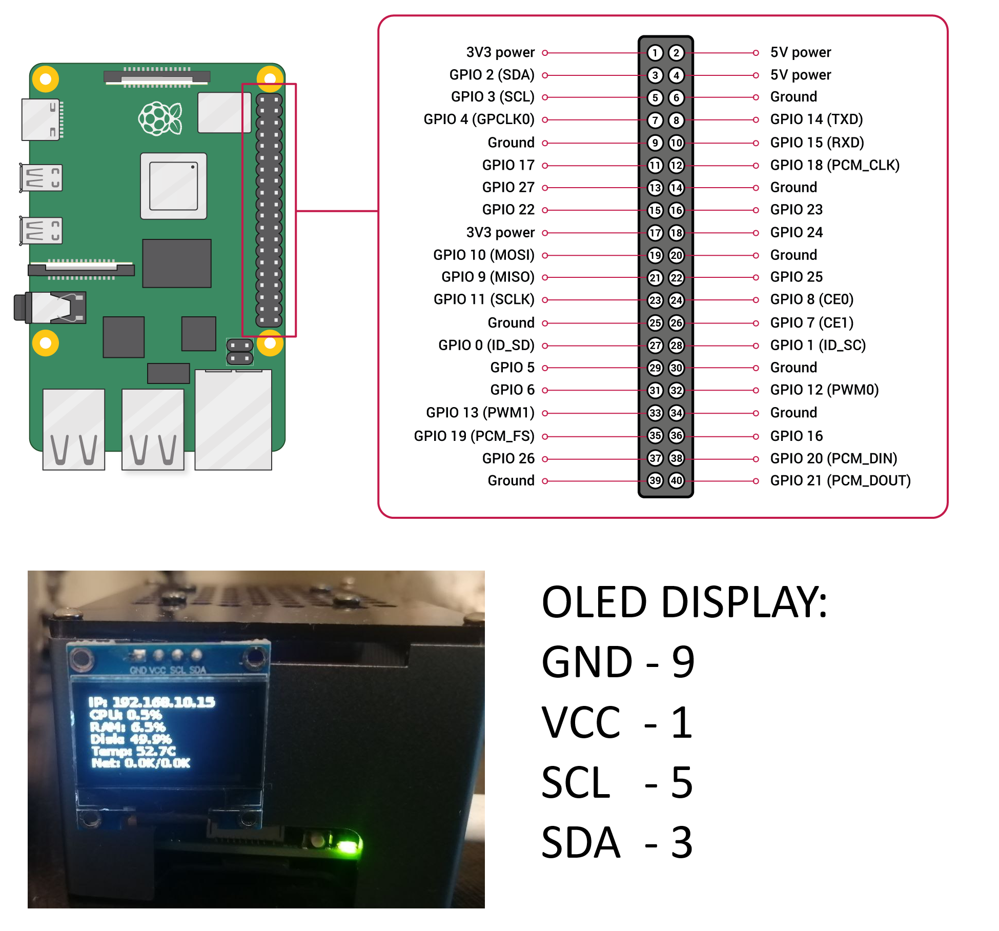

# System-Info-PI5

Displaying system information on an OLED display for Raspberry Pi 5

## Description

This project displays system information such as CPU usage, memory usage, and other vital statistics on an OLED display connected to a Raspberry Pi 5. The project is written in Python and uses several libraries to interact with the hardware and retrieve system information.

## Cloning the Repository

To get started, clone the repository and navigate to the project directory:

```bash
git clone https://github.com/oURMIo/system-info-pi5.git
cd system-info-pi5
```

## Setup and Installation

Before running the project, you need to set up a virtual environment and install the necessary libraries. Follow these steps:

1. Create and activate a virtual environment:

```bash
python3 -m venv oled-status
source oled-status/bin/activate
```

2. Install the required libraries:

```bash
pip install board
pip install busio
pip install adafruit-blinka
pip install psutil
pip install adafruit-circuitpython-ssd1306
pip install pillow
```

## Libraries Used

The following libraries are required for this project:

- `board`
- `busio`
- `adafruit-blinka`
- `psutil`
- `adafruit-circuitpython-ssd1306`
- `pillow`

Install them using:

```bash
pip install board
pip install busio
pip install adafruit-blinka
pip install psutil
pip install adafruit-circuitpython-ssd1306
pip install pillow
```

## Connecting an OLED display



## Usage

After setting up the environment and installing the necessary libraries, you can run the project script to start displaying system information on the OLED display. Ensure your OLED display is properly connected to the Raspberry Pi 5.

To activate the virtual environment and run the script:

```bash
source ./system-info-pi5/venv/bin/activate
python ./system-info-pi5/oled_system_status.py
```

## License

This project is licensed under the MIT License. See the LICENSE.md file for more details
