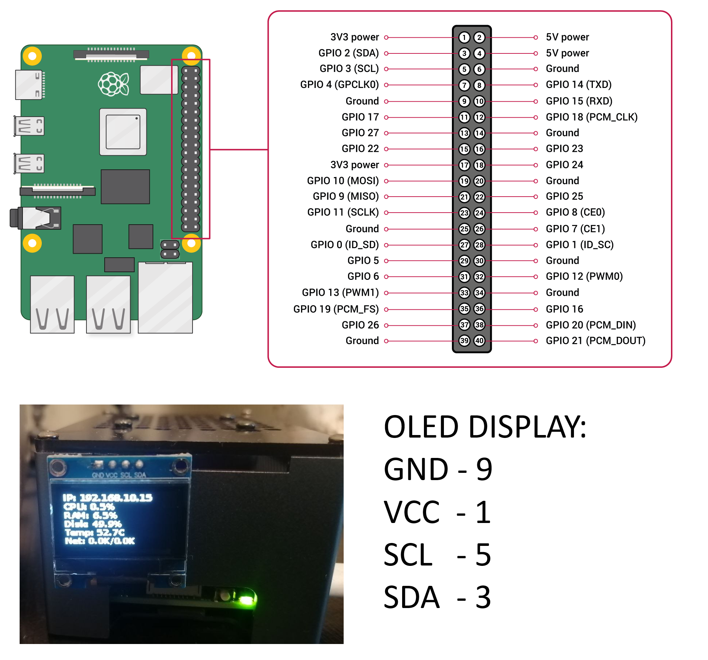

# System-Info-PI5

Display real-time system information on an SSD1306 OLED display connected to a Raspberry Pi 5.

Shows: IP address, CPU/RAM/Disk usage, CPU temperature, and network throughput.



## Scripts

| Script | Description |
|--------|-------------|
| `src/oled_system_status.py` | Continuously displays system stats on the OLED |
| `src/oled_system_status_butten.py` | Same as above, with a button on GPIO17 to toggle the display on/off |
| `src/turn_off_display.py` | Turns the display off |
| `src/test_connection.py` | Scans the I2C bus and verifies the display connection |

## Setup

1. Clone the repository:

```bash
git clone https://github.com/oURMIo/system-info-pi5.git
cd system-info-pi5
```

2. Create a virtual environment and install dependencies:

```bash
python3 -m venv venv
source venv/bin/activate
pip install adafruit-blinka psutil adafruit-circuitpython-ssd1306 pillow
```

## Usage

### Test the connection

```bash
source venv/bin/activate
python src/test_connection.py
```

### Run the status display

```bash
./oled-stats.sh
```

Or manually:

```bash
source venv/bin/activate
python src/oled_system_status_butten.py
```

### Turn off the display

```bash
source venv/bin/activate
python src/turn_off_display.py
```

## Autostart on boot (systemd)

1. Create a service file:

```bash
sudo tee /etc/systemd/system/oled-stats.service << EOF
[Unit]
Description=OLED System Status Display
After=multi-user.target

[Service]
ExecStart=/path/to/system-info-pi5/oled-stats.sh
WorkingDirectory=/path/to/system-info-pi5
Restart=on-failure
User=root

[Install]
WantedBy=multi-user.target
EOF
```

2. Enable and start:

```bash
sudo systemctl daemon-reload
sudo systemctl enable oled-stats.service
sudo systemctl start oled-stats.service
```

## License

MIT License. See [LICENSE.md](LICENSE.md) for details.
